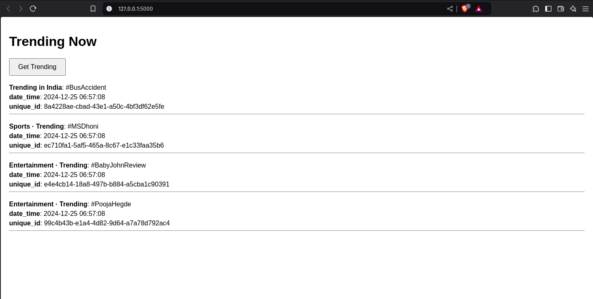

# Trending Page Application

STIR assignment

---

## JSON Response Schema

The backend `/get_trending` endpoint returns a JSON response in the following format:

### Example Response

```json
[
    {
        "unique_id": "8334538f-b62a-43e1-9b3e-4928ca038854",
        "date_time": "2024-12-25 01:42:50",
        "Entertainment · Trending": "#BabyJohnReview"
    },
    {
        "unique_id": "dfe5557f-f669-41a4-9e95-a9f76a8de4e0",
        "date_time": "2024-12-25 01:42:50",
        "Trending in India": "#MerryChristmas"
    },
    {
        "unique_id": "f74a0c07-34b1-4191-974b-f8ebd12b1523",
        "date_time": "2024-12-25 01:42:50",
        "Entertainment · Trending": "#MaxTheMovie"
    }
]
```


# Screenshot

